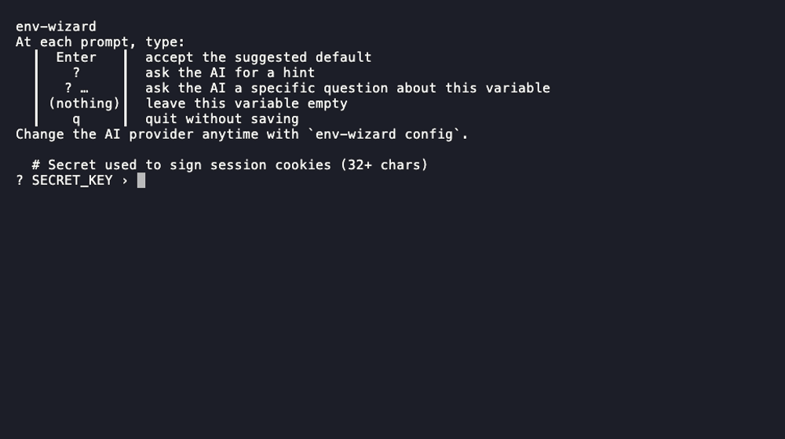

<div align="center">

# 🧙 env-wizard

### Never guess what goes in a `.env` again.

**env-wizard** walks you through `.env.example` one variable at a time — inline hints
as you go, and **your** AI (cloud *or* local) on standby for anything unclear. Then it
writes `.env` for you, safely.

Config in TOML/YAML/JSON? Same walkthrough, real file written, every comment kept.

No example file? It **scans your code** (JS/TS, Python, Rust, Go, Ruby, PHP) instead.

[](LICENSE)


-lightgrey)

</div>

---

## ⚡ Install

Hand it to a coding agent, or pick the method for your OS — then run
`env-wizard` inside any repo that has a `.env.example`.

### 🤖 Installing via a coding agent

Working with Claude Code, Codex, or another coding agent? Just hand it this prompt:

```
Install env-wizard from https://github.com/alphonse-terrier/env-wizard
```

<details>
<summary>Manual install instructions (macOS / Linux / Windows / Cargo)</summary>

### 🍎 macOS

**Homebrew** (recommended):

```sh
brew tap alphonse-terrier/env-wizard
brew install env-wizard
```

<details>
<summary>Or download a prebuilt binary</summary>

```sh
# Apple Silicon (M1/M2/M3…). For an Intel Mac, swap aarch64 → x86_64.
curl -L https://github.com/alphonse-terrier/env-wizard/releases/download/v0.5.0/env-wizard-v0.5.0-aarch64-apple-darwin.tar.gz | tar xz
sudo mv env-wizard-v0.5.0-aarch64-apple-darwin/env-wizard /usr/local/bin/
```

</details>

### 🐧 Linux

**Homebrew** (if you use it):

```sh
brew tap alphonse-terrier/env-wizard
brew install env-wizard
```

**Prebuilt static binary** (x86_64, no dependencies):

```sh
curl -L https://github.com/alphonse-terrier/env-wizard/releases/download/v0.5.0/env-wizard-v0.5.0-x86_64-unknown-linux-musl.tar.gz | tar xz
sudo mv env-wizard-v0.5.0-x86_64-unknown-linux-musl/env-wizard /usr/local/bin/
```

### 🪟 Windows

Install with Cargo (needs the [Rust toolchain](https://rustup.rs)):

```powershell
cargo install --git https://github.com/alphonse-terrier/env-wizard
```

### 📦 Any OS — with Cargo

Works everywhere Rust runs:

```sh
cargo install --git https://github.com/alphonse-terrier/env-wizard
```

<details>
<summary>Build from a local clone</summary>

```sh
git clone https://github.com/alphonse-terrier/env-wizard
cd env-wizard
cargo install --path .
```

</details>

> **Verify a download** against [`SHA256SUMS`](https://github.com/alphonse-terrier/env-wizard/releases/latest) on the release page.

</details>

### First run

```sh
cd my-freshly-cloned-project
env-wizard
```

That's it. 🎉

The first time you press `?` for a hint, env-wizard asks which AI to use — pick
one from a short list (Claude, OpenAI, local Ollama, LM Studio, OpenRouter, Groq,
or your own) and it's remembered from then on. No config file to write by hand,
no API to wire up. See [Choose your AI](#-choose-your-ai).

---

**Jump to:** [Demo](#-see-it-in-action) · [Features](#-why-youll-like-it) · [Scan your code](#-scan-your-code-for-env-vars) · [Config templates](#-toml--yaml--json-config-templates) · [Choose your AI](#-choose-your-ai) · [Usage](#-usage-reference) · [How it works](#-how-it-works) · [FAQ](#-faq)

## 🎬 See it in action

Here's what a real run looks like:



> The `💡 Hint` is your AI's answer, rendered cleanly in the terminal — headings,
> bullets, and commands, with the raw Markdown stripped away. Need something specific?
> Type your question after the `?` (e.g. `? what format is expected?`) and the AI
> answers it directly.

<details>
<summary>Prefer plain text? Here's the same run as a transcript</summary>

```console
$ env-wizard
env-wizard
At each prompt, type:
  ┃  Enter   ┃  accept the suggested default
  ┃    ?     ┃  ask the AI for a hint
  ┃   ? …    ┃  ask the AI a specific question about this variable
  ┃ (nothing)┃  leave this variable empty
  ┃    q     ┃  quit without saving
Change the AI provider anytime with `env-wizard config`.

  # Secret used to sign session cookies (32+ chars)
? SECRET_KEY › ?

💡 Hint
SECRET_KEY
This signs your session cookies. Generate one with:

    openssl rand -hex 32

 • Must be at least 32 characters
 • Keep it secret — put it in .env, never commit it

? SECRET_KEY › 9f2c8a…                ← you paste the real value
✔ SECRET_KEY · 9f2c8a…
✓ Wrote .env
```

</details>

## 💛 Why you'll like it

- 🧭 **Guided, not guesswork** — every variable's `.env.example` comment shows inline
  as a hint, *before* you ever call the AI.
- 🤖 **Your AI, your rules** — hints come from whatever provider you pick: Claude,
  OpenAI, a local Ollama model, or any OpenAI-compatible endpoint. Nothing is
  hardcoded, and env-wizard stores **no** API keys.
- 🔒 **Private by design** — your `.env` values are **never** sent to any AI, cloud or
  local. And with a local provider (Ollama, LM Studio at `http://localhost:11434`) the
  whole prompt stays on your machine — nothing leaves at all.
- 🧠 **Repo-aware hints** — the AI is fed your README, common config files, and every
  place the variable appears in the code, so its advice is specific — not generic.
- 🔎 **Catches drift** — `env-wizard scan` audits your `.env.example` against what's
  actually used in the code (8 languages), and can even work with **no example at all**.
- 📄 **Not just `.env`** — TOML, YAML, and JSON config templates get the same guided
  walkthrough, and only the values you change are ever touched.
- 💾 **Safe, tidy writes** — confirms before overwriting an existing `.env`, keeps a
  `.env.bak`, carries your `.env.example` comments over each variable, and writes the
  file `0600` (owner-only) on Unix.
- 🪶 **One small binary** — written in Rust. No runtime, no daemon, starts instantly.

## 🔎 Scan your code for env vars

`.env.example` files drift: someone adds `process.env.STRIPE_SECRET_KEY` to the code and
forgets the example. env-wizard reads the **source itself** — JS/TS, Python, Rust, Go,
Ruby, PHP — to catch that before it costs you twenty minutes of debugging.

<details>
<summary>Show details</summary>

```console
$ env-wizard scan
Used in code but missing from .env.example (2):
  • REDIS_URL src/cache.py:1
  • STRIPE_SECRET_KEY src/server.js:2

Declared in .env.example but not found in code (1):
  • OLD_FEATURE_FLAG
```

Three ways to use it:

| Command | What it does |
| ------- | ------------ |
| `env-wizard scan` | **Audit**, read-only: what's used in code but missing from the example (with `file:line`), and what's declared but unused. |
| `env-wizard scan --check` | Same audit, but **exits with status 1 if any drift is found** — drop it in CI to catch a `.env.example` that's fallen out of sync. |
| `env-wizard` *(no `.env.example` present)* | **Fallback**: derives the variable list straight from the code and runs the wizard anyway. |
| `env-wizard --from-code` | **Augment**: prompts for the example's variables *plus* any extras found in the code. |

Before falling back to code detection, env-wizard also tries common example filename
aliases when `--input` is omitted: `.env.sample`, `.env.dist`, `.env.template`, and
`env.example` (no leading dot).

Detected patterns:

| Language | Detected |
| -------- | -------- |
| JS / TS  | `process.env.FOO`, `process.env["FOO"]`, `import.meta.env.FOO` |
| NestJS (`@nestjs/config`) | `configService.get("FOO")`, `.get<Type>("FOO")`, `.getOrThrow("FOO")` |
| Zod env schemas (zod / t3-env / znv) | `FOO: z.string()` — any `SCREAMING_SNAKE_CASE` key mapped to a zod validator |
| Python   | `os.environ["FOO"]`, `os.environ.get("FOO")`, `os.getenv("FOO")` |
| Rust     | `env::var("FOO")`, `env!("FOO")`, `option_env!("FOO")` |
| Go       | `os.Getenv("FOO")`, `os.LookupEnv("FOO")` |
| Ruby     | `ENV["FOO"]`, `ENV.fetch("FOO")` |
| PHP      | `getenv("FOO")`, `$_ENV["FOO"]` |
| C#       | `Environment.GetEnvironmentVariable("FOO")` |
| Java / Kotlin | `System.getenv("FOO")` |

> Heuristic (regex, v1): computed keys like `process.env[someVar]` can't be detected
> reliably. The NestJS and Zod patterns lean on conventions rather than a fixed API —
> a `configService` receiver name, a `z` import alias, `SCREAMING_SNAKE_CASE` keys —
> so a differently-named config service or a non-conventional schema won't be picked up.
> As everywhere else, real `.env` files are never read — only source code. (`src/scan.rs`)

</details>

## 📄 TOML / YAML / JSON config templates

Not every project configures itself through the environment. If yours ships a
structured example instead — `config.example.toml`, `settings.sample.yaml`,
`appsettings.example.json` — env-wizard walks that the same way it walks
`.env.example`: one field at a time, dotted path shown as the prompt (`database.host`),
the example's value as the default, and its comment (or JSONC `//`/`/* */` comment) as
the hint.

<details>
<summary>Show details</summary>

```console
$ env-wizard
Using config.example.toml (no .env.example found).

  # Hostname to connect to
? database.host (localhost) › db.prod
✔ database.port · 5432
✔ database.enabled · true
✓ Wrote config.toml
```

Only the values you actually change are touched — everything else (comments, key
order, indentation, untouched siblings) comes out **byte-for-byte identical** to the
example. Only scalar fields (string/number/bool) are prompted; arrays and nested
tables you don't edit are carried over as-is.

Detection is automatic: env-wizard reads the file and detects the format from its
actual content (TOML/YAML/JSON), falling back to the file extension only when the
content itself isn't decisive (e.g. empty). That means a misnamed template
(`config.example.json` that's actually TOML) or one with no extension at all
(`config.example`) still works. A template is still recognized by its filename
(`example`/`sample`/`dist`/`template`) the same way it is for `.env.example`
aliases — dotenv examples still take priority if both exist, and dotenv-shaped
filenames (`.env`, `.env.example`, …) are never reinterpreted as a structured
format no matter what their content looks like. You can always be explicit with
`--input`/`-o`. `--from-code` and `env-wizard scan` are dotenv-only, since a code
scanner has nothing to say about config keys.

</details>

## 🧩 Choose your AI

The **first time** you press `?`, env-wizard asks which AI to use and remembers your
choice. Two kinds are supported:

| Kind | What it is | Presets |
| ---- | ---------- | ------- |
| **CLI command** | Pipes the prompt to a local/cloud CLI. Manages its own auth — no keys stored. | Claude (`claude -p`), Ollama (`ollama run <model>`), or any custom command |
| **OpenAI-compatible HTTP** | `base_url` + `model` + an env var for the API key. | OpenAI, local Ollama (`http://localhost:11434/v1`), LM Studio, OpenRouter, Groq… |

<details>
<summary>Show details — changing your provider</summary>

### Changing your provider

Two equivalent ways — pick whichever you like:

```sh
env-wizard config          # re-run the interactive picker
```

…or edit the config file by hand. Its location is, in order: `$ENV_WIZARD_CONFIG` if
set, else `$XDG_CONFIG_HOME/env-wizard/config.toml`, else your OS config dir —
`~/.config/env-wizard/config.toml` on Linux, `~/Library/Application
Support/env-wizard/config.toml` on macOS, `%APPDATA%\env-wizard\config.toml` on Windows:

```toml
kind  = "command"          # "command" | "openai"
label = "Claude (CLI)"     # shown while fetching a hint

[command]                  # when kind = "command"
program    = "claude"
args       = ["-p"]
prompt_via = "arg"         # "arg" (append prompt) | "stdin" (pipe prompt)

# [openai]                 # when kind = "openai"
# base_url    = "https://api.openai.com/v1"
# model       = "gpt-4o-mini"
# api_key_env = "OPENAI_API_KEY"   # empty = no auth (e.g. local Ollama)
```

</details>

## 📖 Usage reference

Run it at the root of a repo that has a `.env.example`:

```sh
env-wizard
```

<details>
<summary>Show details</summary>

**At each prompt:**

| Input                        | Effect                                            |
| ---------------------------- | ------------------------------------------------- |
| `Enter`                      | Accept the shown default                          |
| `?` / `/hint`                | Ask the AI for a hint, then re-prompt             |
| `? <question>` / `/ask <question>` | Ask the AI a **specific question** about this variable |
| *(empty)*                    | Leave the variable empty                          |
| `q`                          | Quit without writing                              |

**Options:**

| Flag                  | Description                                          |
| --------------------- | ---------------------------------------------------- |
| `-i, --input <PATH>`  | Example file to read. Omit it to auto-detect: dotenv aliases (`.env.example`, `.env.sample`, `.env.dist`, `.env.template`, `env.example`) first, then a `.toml`/`.yaml`/`.json` config template |
| `-o, --output <PATH>` | File to write. Defaults to `.env` for a dotenv example, or the template's name with the marker stripped for a config template (`config.example.toml` → `config.toml`) |
| `-y, --yes`           | Accept all defaults and overwrite without confirming |
| `--no-ai`             | Disable the AI hint feature (no calls to a provider) |
| `--from-code`         | Also prompt for variables discovered in the code (dotenv only) |

**Commands:**

| Command             | Description                              |
| ------------------- | ---------------------------------------- |
| `env-wizard`        | Run the interactive `.env` filler        |
| `env-wizard config` | Choose or change the AI provider         |
| `env-wizard scan`   | Audit code usage vs `.env.example` (add `--check` to exit 1 on drift, for CI) |
| `env-wizard completions <shell>` | Print a shell completion script (bash, zsh, fish, elvish, powershell) |

</details>

## 🛠 How it works

A quick look at the request → hint pipeline:

<details>
<summary>Show details</summary>

```
.env.example ──▶ parse ──▶ prompt loop ──▶ .env
                              │
                   type "?" ──┤
                              ▼
              gather repo context (README + configs + grep)
                              ▼
                 your AI provider (CLI or HTTP)
                              ▼
                render the hint cleanly in the terminal
```

</details>

## ❓ FAQ

Common questions about privacy, AI providers, and platform support:

<details>
<summary>Show details</summary>

**What exactly is sent to the AI, and does it leave my machine?**
Only what's needed for a hint: the variable name, its `.env.example` comment, and repo
context (your README, common config files, and code lines that mention the variable).
The values you type and your existing `.env` are **never** sent. With a **local**
provider (Ollama, LM Studio) even that context stays on your machine — only a **cloud**
provider receives it over the network. env-wizard has no telemetry and stores no API
keys; providers use their own configured credentials.

**Could my existing `.env` secrets be sent to the AI?**
No. When building context, env-wizard deliberately **skips real dotenv files**
(`.env`, `.env.local`, `.env.production`, …) — only template files like `.env.example`
are ever read. So values already in your `.env` are never included in a prompt.
(See `is_secret_env_file` in `src/repo.rs`.)

**I don't have an AI CLI installed — is env-wizard still useful?**
Yes. The whole guided flow (inline comment hints, defaults, safe writing) works
without any AI. If you press `?` and the chosen provider isn't reachable, you get a
clear error and the wizard simply continues. You can also run with `--no-ai`.

**Which platforms are supported?**
Prebuilt binaries and Homebrew cover macOS and Linux. Windows works via
`cargo install` (the code is cross-platform) but isn't part of the release binaries
yet — feedback welcome.

</details>

## 📦 Requirements

- Nothing extra for the Homebrew or prebuilt-binary installs. A Rust toolchain
  (`cargo`) is only needed for the Cargo / from-source methods.
- For the `?` hint only: the provider you pick must be reachable — the chosen CLI on
  your `PATH`, or the HTTP endpoint up with its API key set. If not, everything else
  still works and the hint reports a clear error.

## 🤝 Contributing

If env-wizard saved you the twenty minutes of `.env` archaeology, a ⭐ on the repo
helps other people find it too.

Issues and PRs are welcome! Before opening a PR, please run:

```sh
cargo test
cargo clippy --all-targets
```

## 📄 License

[MIT](LICENSE) © Alphonse Terrier
</content>
